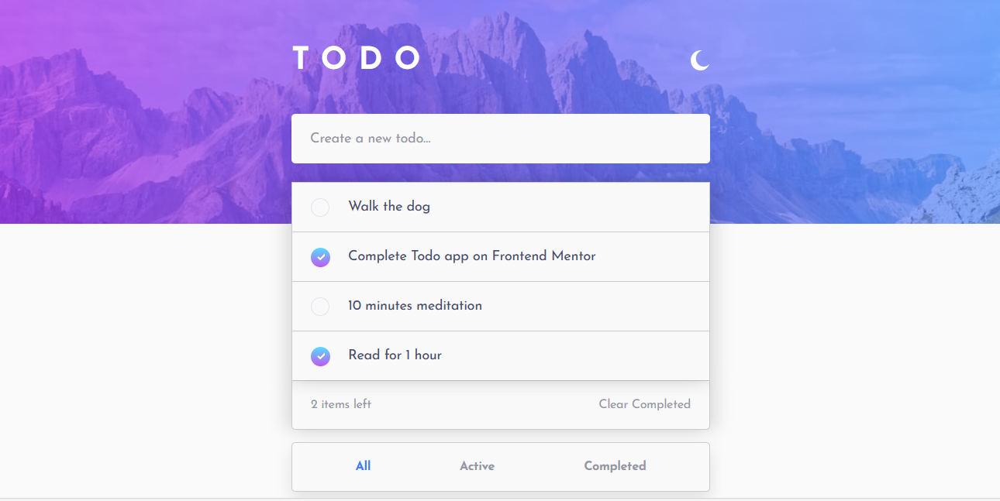
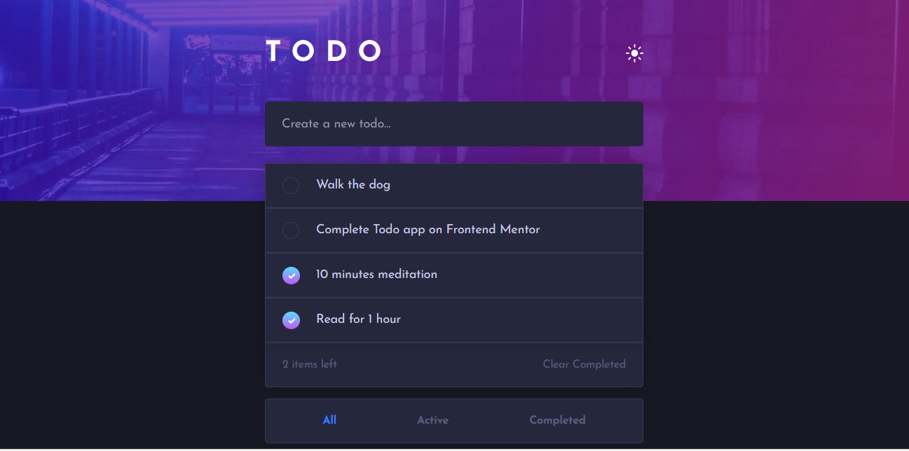

# ___ToDo App - Frontend___

It is my first full-stack project. Todo App is a simple web application built using Django that allows users to create and manage their to-do lists.

## __Features__
- Create new tasks.
- Mark tasks as completed.
- Delete tasks.
- Filter tasks by status (All, Active, Completed).
- Dark mode for improved usability.

## __Demo__
You can see a live demo of the app (https://www.youtube.com/watch?v=cUexvogzEos)

## __Screenshots__

## __Technologies Used__

- Python (Django) for the backend.
- HTML, CSS, and JavaScript for the frontend.
- SQLite for the database.

## __Usage__

- Create a new task by entering a task description and pressing Enter.
- Mark tasks as completed by checking the checkbox next to the task.
- Delete tasks by clicking the delete button (cross icon).
- Filter tasks by clicking on the All, Active, or Completed tabs.
- Toggle dark mode by clicking the moon/sun icon.

## __Contributing__

If you'd like to contribute to this project, please follow these steps:

1. Fork the project.
2. Create a new branch for your feature or bug fix.
3. Make your changes and commit them with clear, concise commit messages.
4. Push your changes to your fork.
5. Create a pull request to merge your changes into the main repository.

## Getting Started
Clone the repository:
   `git clone https://github.com/Anano24/todo-app-frontend`
- This app works with todo-server directory.

